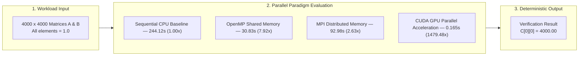

# Performance Analysis of Matrix Multiplication

[](#)
[](#)
[](#)
[](#)

---

## Executive Summary

This repository contains the empirical performance analysis, parallel execution models, and benchmark results for a **$4000 \times 4000$ Matrix Multiplication** ($C = A \times B$) across four computing paradigms: Sequential, OpenMP, MPI, and CUDA.



### Key Finding

> **CUDA GPU acceleration achieved an overall execution time of 0.165 seconds (0.146s kernel execution) — representing a 1,479.48× speedup over single-threaded sequential CPU execution (244.12s) and a 186.85× speedup over 8-thread OpenMP shared-memory execution (30.83s).**

---
## 1. Experiment Objectives

1. **Multi-Model Parallelization**

   Implement a uniform 4000 × 4000 matrix multiplication workload
   using Sequential, OpenMP, MPI and CUDA.

2. **Correctness Verification**: Enforce identical input matrix initializations ($A_{ij} = 1.0, B_{ij} = 1.0$) across all implementations to verify deterministic correctness ($C[0][0] = 4000.00$).
   All implementations use:

   ```text
   A[i][j] = 1.0
   B[i][j] = 1.0

3. **Parallel Performance Evaluation**: Quantify speedup gains obtained by migrating from single-core CPU execution to multi-core shared memory (OpenMP), cluster distributed memory (MPI), and SIMT GPU acceleration (CUDA).
4. **Overhead Analysis**: Analyze communication latency in network-bound MPI clusters and host-to-device memory transfer overheads ($H2D$ / $D2H$) in CUDA.

